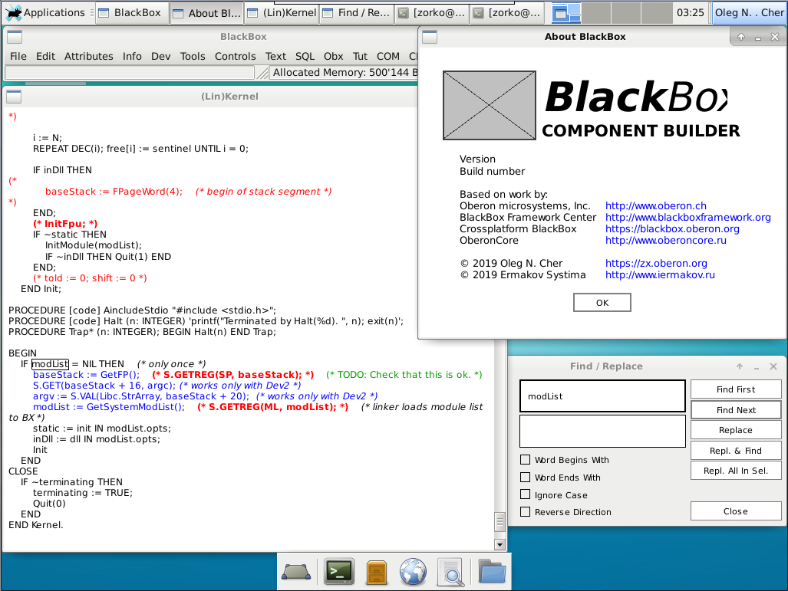

BlackBox Component Builder port for Linux/ARM
=============================================

Based on cross-platform BlackBox version

  https://blackbox.oberon.org

Modified modules are published under GPL 3.0

Build it with CPfront (Component Pascal to C Translator) and GCC

  https://github.com/Oleg-N-Cher/CPfront

  Build/Build.odc - list modules for translation  
  Obj48/Makefile  - use it to build executable

Copyright (c) 2019 Oleg N. Cher - zx.oberon.org  
Copyright (c) 2019 Ermakov Systima - www.iermakov.ru  
Copyright (c) 2017-2020 A.V. Shiryaev, I.A. Denisov, I.A. Dehtyarenko, A.A. Dmitriev  
Copyright (c) 2013-2019 BlackBox Framework Center  
Copyright (c) 1994-2013 Oberon microsystems, Inc., Switzerland. All rights reserved.  
